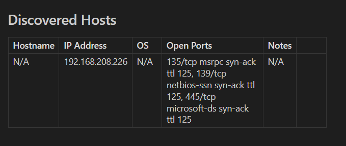

# NmapMD

## Description
This Python script automates the process of running nmap scans and formats the output into a Markdown file. It's designed to make it easier to document and review the network environments you are analyzing.

## Features
- Runs nmap scans with user-defined arguments.
- Generates a Markdown file that documents discovered hosts, their IP addresses, open ports, and operating system details if available.
- Option for converting a specific .nmap file to the simplified Markdown table format
## Requirements
- Python 3
- nmap: Must be installed on the system and accessible via the command line.

## Installation
```bash
git clone https://github.com/xBurningGiraffe/Misc.Scripts/Python/nmapMD.git
cd nmapMD
```

## Usage
To use the script, you can pass nmap arguments directly through the command line. For example:
```bash
./nmapMD.py -o output_filename.md -- 192.168.208.226 -p 135,139,445 -vv
./nmapMD.py -o output_filename.md -- -iL hosts.txt -sC -sV -vv
```
Alternatively, if you'd prefer to run nmapMD from any terminal, you can do the following (requires sudo privileges):
```bash
sudo mkdir /opt/nmapMD && sudo mv nmapMD.py /opt/nmapMD
sudo ln -svf /opt/nmapMD/nmapMD.py /usr/bin/nmapMD
sudo chmod +x /usr/bin/nmapMD
```

## Example of Output
The following screenshot shows an example of the Markdown output generated by this script:



The Markdown file includes a table listing the discovered hosts, IP addresses, operating system details (if detected), open ports, and additional notes.

## Contributing
Contributions to this project are welcome. Please fork the repository and submit a pull request with your changes.

## License
Distributed under the MIT License. See `LICENSE` for more information.

## Contact
Your Name - xburninggiraffe@gmail..com
Project Link: (https://github.com/xBurningGiraffe/Misc.Scripts/tree/main/Python/nmapMD)
